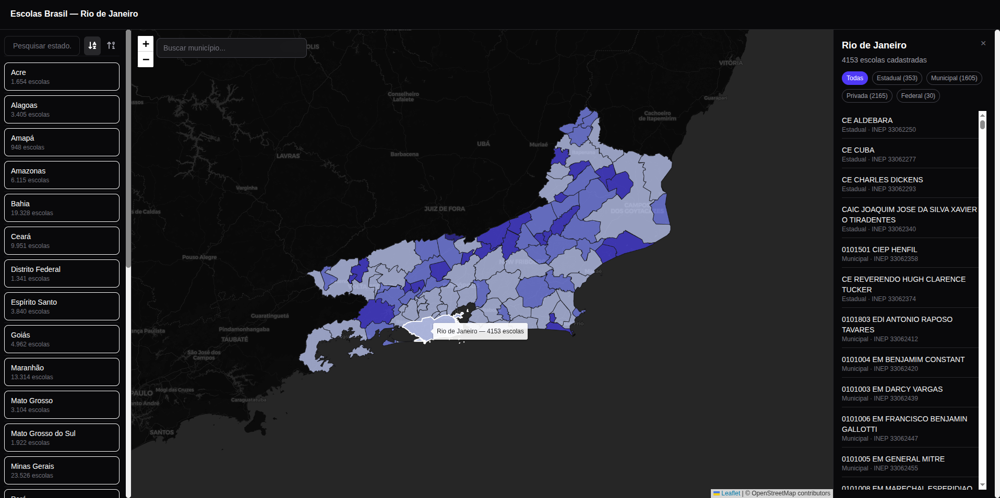

# Escolas Brasil

> ⚠️ **Work in progress — early alpha.** Expect bugs, incomplete data, and breaking changes.

Interactive geospatial dashboard mapping public schools across 
all Brazilian municipalities, built with SvelteKit and Leaflet.js.



## Status

This project is in early development. Current known limitations:
- Not all states have complete school data
- Mobile layout not yet optimized
- Search and filter features still being refined
- Display bugs still occurring

## Features (so far)

- Interactive choropleth map — municipalities colored by number of schools
- State selector with sorting (A–Z, most/least schools)
- Municipality search with real-time filtering
- Detail panel with school data per municipality

## Tech Stack

SvelteKit · Svelte 5 (runes) · TypeScript · Leaflet.js · GeoJSON · Tailwind CSS

## Running locally

```bash
npm install
npm run dev
```

## Data source

Public school data from INEP — Instituto Nacional de Estudos 
e Pesquisas Educacionais Anísio Teixeira.